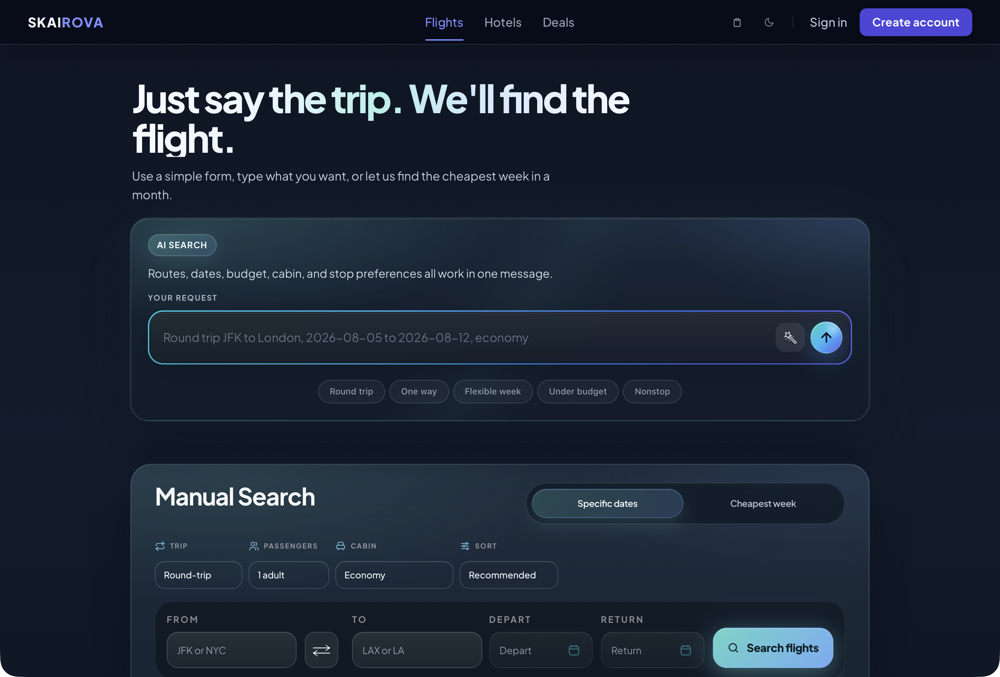
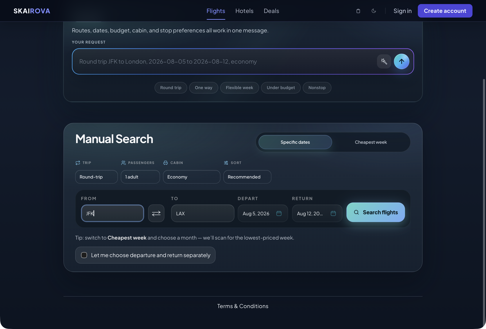
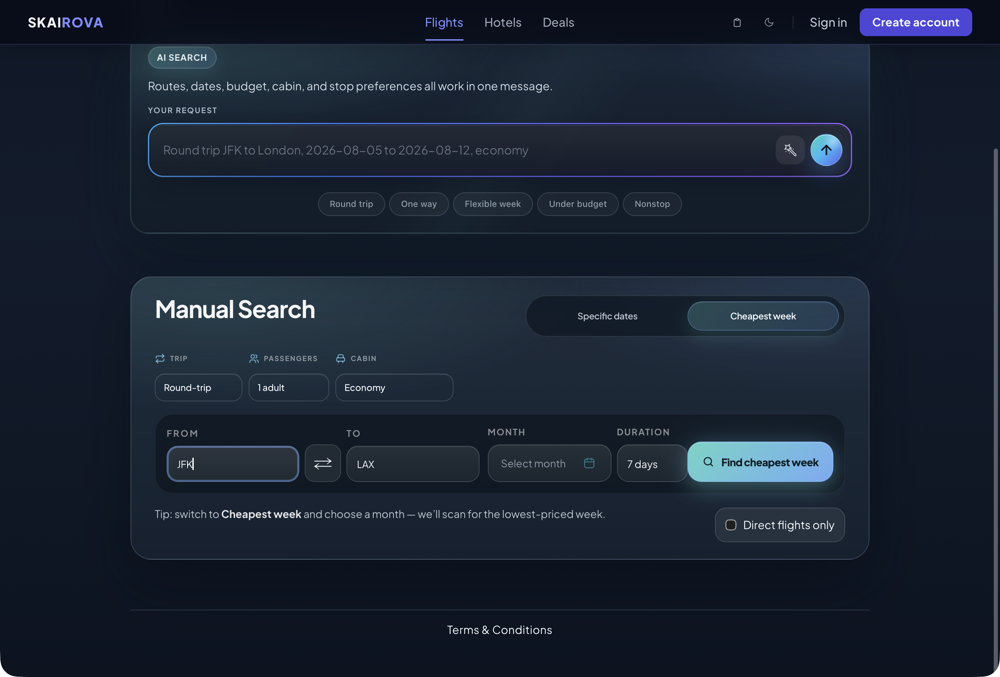
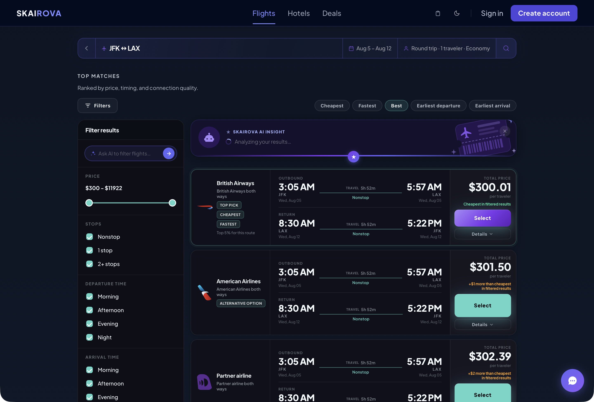
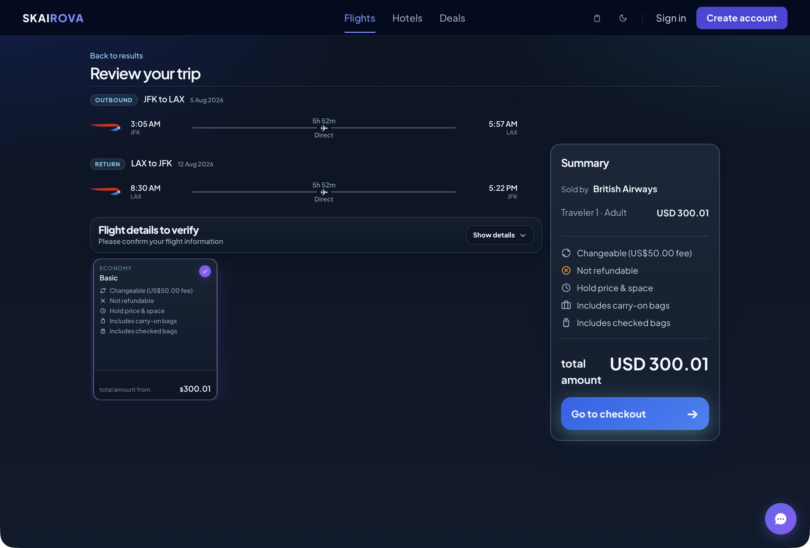
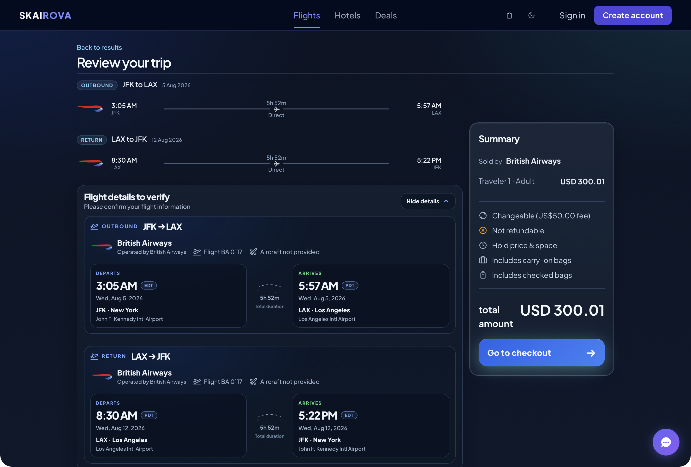
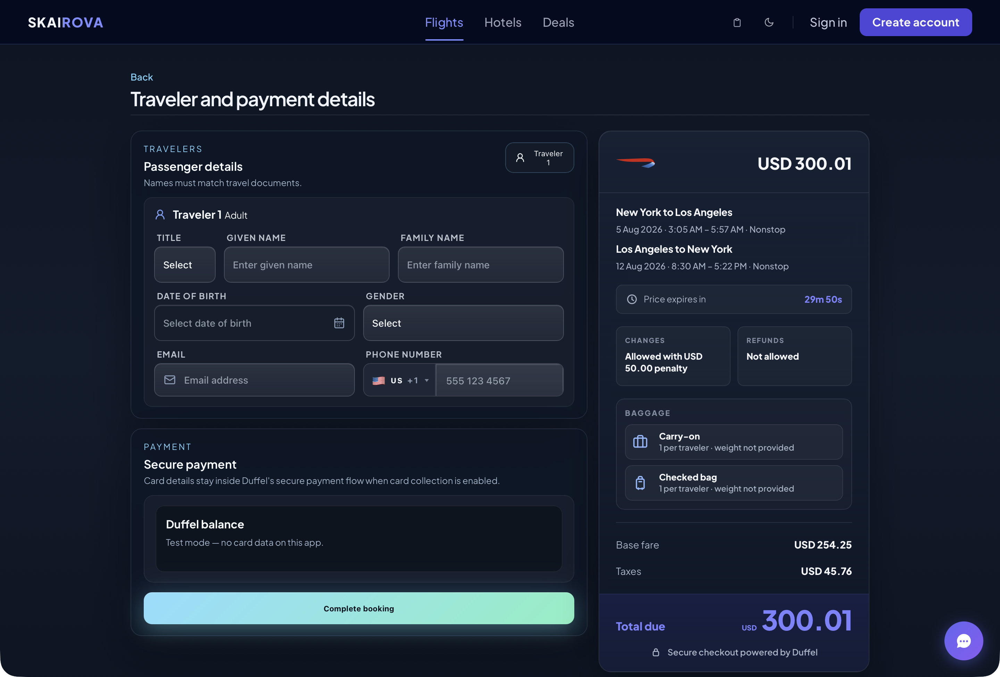
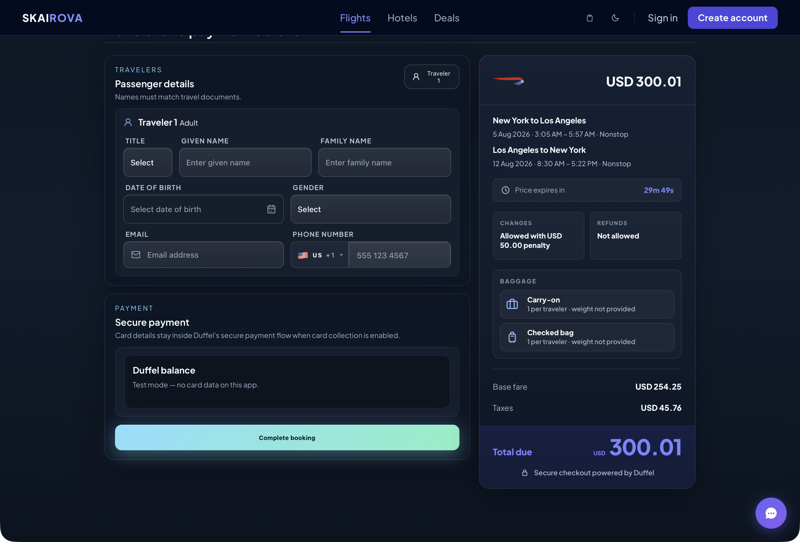
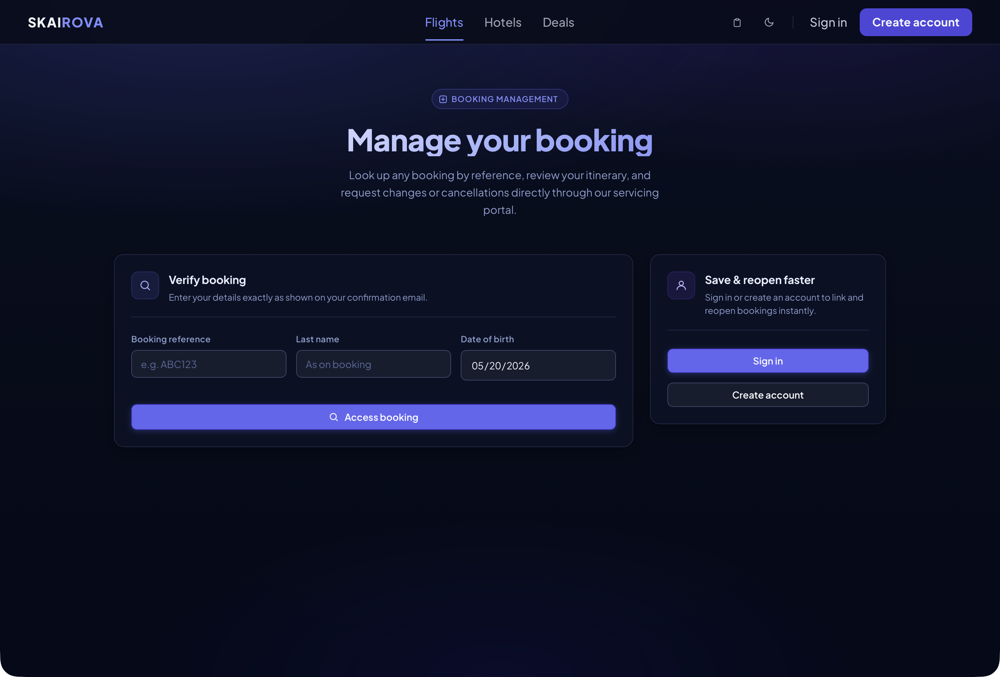
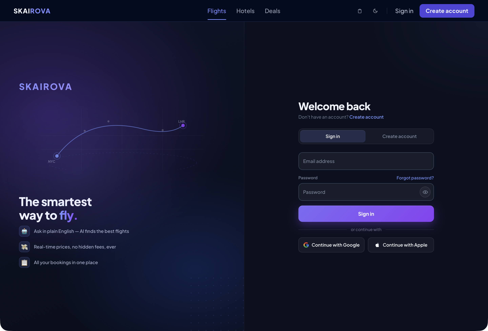

# Skairova User Manual

This manual explains how a regular customer uses Skairova to search for flights, review flight details, enter traveler information, and complete a booking.

No technical knowledge is required. A user only needs a web browser, internet access, traveler details, and payment details if live payments are enabled.

---

## 1. Open Skairova

Open the Skairova website in your browser.

The homepage opens on the **Flights** section. From here, you can search using either **AI Search** or **Manual Search**.



---

## 2. Search Using AI Search

Use **AI Search** when you want to describe your trip in plain language.

1. Click inside the **Your request** text box.
2. Type your trip request.
3. Include the route, date, cabin, budget, or stop preference if you know them.
4. Click the round send button on the right side of the text box.

Example request:

```text
Nonstop from SFO to JFK on 2026-11-22, economy
```

You can also write requests such as:

```text
JFK to LAX from August 5 to August 12, one adult, economy
```

The AI can understand:

- Departure city or airport
- Destination city or airport
- Departure date
- Return date
- Cabin class
- Nonstop preference
- Budget preference
- Flexible travel timing

If the AI cannot understand the request, reword it with clearer airport names and dates.

---

## 3. Open Manual Search

Use **Manual Search** if you prefer filling out fields yourself.

1. Click **Manual search** below the AI Search card.
2. The full manual search form opens.



---

## 4. Fill Out Manual Search

In Manual Search, complete the trip fields.

1. Choose the trip type.
2. Choose the number of passengers.
3. Choose the cabin.
4. Choose the sort option.
5. Enter the departure city or airport in **From**.
6. Enter the destination city or airport in **To**.
7. Choose the departure date.
8. Choose the return date if this is a round trip.
9. Click **Search flights**.

Trip type options may include:

- Round-trip
- One-way

Cabin options may include:

- Economy
- Premium Economy
- Business
- First

Sort options may include:

- Recommended
- Cheapest
- Fastest

Important: For best results, use airport codes such as `JFK`, `LAX`, `SFO`, or clear city names such as `New York` or `Los Angeles`.

---

## 5. Search For The Cheapest Week

Use **Cheapest week** when your travel dates are flexible.

1. Open **Manual Search**.
2. Select **Cheapest week**.
3. Enter the departure city or airport.
4. Enter the destination city or airport.
5. Select the month.
6. Select the trip duration.
7. Click **Find cheapest week**.

Skairova scans possible dates in that month and looks for the lowest-priced trip window.



---

## 6. Review Flight Results

After searching, Skairova opens the Results page.



Each result can show:

- Airline
- Departure time
- Arrival time
- Departure airport
- Arrival airport
- Flight duration
- Stop or nonstop information
- Total price
- Price comparison
- Details button
- Select button

Use this page to compare flights before choosing one.

---

## 7. Edit A Search From The Results Page

At the top of the Results page, you can adjust the search without returning to the homepage.

You can change:

- Route
- Dates
- Passengers
- Cabin
- Sort option
- Trip type

After changing the details, run the search again to refresh the results.

---

## 8. View Flight Details

Some results include a **Details** option.

Open the details area when you want more information about the flight, especially if the trip has stops.

Details may include:

- Stop airport
- Arrival time at the stop
- Departure time from the stop
- Layover duration
- Segment details
- Airline and operating airline information

This is useful when comparing connecting flights.

---

## 9. Select A Flight

When you find a flight you want:

1. Review the price and timing.
2. Check whether it is nonstop or has stops.
3. Click **Select**.

Skairova then opens the trip review page.

---

## 10. Review Your Trip

The **Review your trip** page gives a clearer view of the selected flight before checkout.



Review:

- Outbound flight
- Return flight, if this is a round trip
- Airline
- Route
- Departure time
- Arrival time
- Travel date
- Duration
- Direct or stop information
- Price summary

Do not continue until the route and dates are correct.

---

## 11. Expand Complete Flight Details

Click **Show details** to open the full flight information.



The expanded view can show:

- Marketing airline
- Operating airline
- Flight number
- Aircraft type
- Departure airport
- Arrival airport
- Departure time and time zone
- Arrival time and time zone
- Segment duration
- Stop or layover information
- Airport names and cities

This page is where the user should confirm the complete flight from start to finish.

---

## 12. Choose A Fare Option

If multiple fares are available, Skairova may show fare cards.

A fare card may include:

- Cabin type
- Fare name
- Whether changes are allowed
- Whether refunds are allowed
- Carry-on bag information
- Checked bag information
- Price

Select the fare that best matches your needs.

---

## 13. Review The Price Summary

The price summary shows the selected trip total.

It may include:

- Airline selling the ticket
- Traveler count
- Fare benefits
- Baggage information
- Change rules
- Refund rules
- Total amount

Click **Go to checkout** when ready.

---

## 14. Enter Traveler Details

The checkout page asks for passenger information.



Enter the traveler’s details exactly as they appear on official travel documents.

Required fields may include:

- Title
- Given name
- Family name
- Date of birth
- Gender
- Email address
- Phone number

Important: Incorrect names can cause airline check-in or boarding problems.

---

## 15. Enter Passport Or Identity Details If Requested

Some international flights require identity document details.

If Skairova shows document fields, enter:

- Passport number
- Passport issuing country
- Passport expiration date
- Nationality, if requested

If these fields are not shown, they are not required for that booking.

---

## 16. Review The Checkout Price

The checkout price section shows the final payment information.

It can include:

- Airline logo
- Route summary
- Flight date and time
- Price expiration timer
- Change rules
- Refund rules
- Included baggage
- Base fare
- Taxes
- Total due

Review this carefully before booking.

---

## 17. Complete Payment

Scroll to the payment section.



Depending on the environment, the payment section may show:

- Duffel balance for test bookings
- Secure card payment for live bookings

When all traveler and payment details are complete, click **Complete booking**.

Do not refresh or close the page while the booking is being submitted.

---

## 18. View Booking Confirmation

After a successful booking, Skairova opens a confirmation page.

The confirmation page may show:

- Booking reference
- Booking status
- Airline
- Route
- Flight details
- Traveler details
- Baggage allowance
- Payment summary
- Fare and ticket rules

From the confirmation page, users may also access itinerary tools such as a PDF itinerary or calendar file.

Screenshot to add after a successful test booking: Booking confirmation page.

---

## 19. Manage A Booking

Use **Manage Booking** if you need to find or update an existing booking.



Depending on the booking and airline rules, you may be able to:

- View booking details
- See linked bookings
- Request cancellation
- Request flight change options
- Apply an available flight change

You may need to enter:

- Booking reference
- Passenger name
- Other verification information

---

## 20. Sign In Or Create An Account

Users can sign in or create an account.



An account can help users:

- View their portal
- Link bookings
- Save profile details
- Save preferences
- Review recent searches
- Manage account settings

Skairova may also offer Google or Apple sign-in if those options are configured.

---

## 21. Use The User Portal

After signing in, the user portal may show:

- Saved or recent searches
- Linked bookings
- Profile details
- Travel preferences
- Account security options

Users can update preferences and profile information from the portal.

---

## 22. Use The AI Chat Assistant

Some pages include an AI chat bubble.

The chat assistant can help with:

- Understanding flight options
- Explaining search results
- Checkout questions
- General booking guidance

Click the chat bubble to open it, type a question, and send the message.

---

## 23. Hotels Page

The Hotels page is currently a coming-soon page.


Users can open it from the header, but hotel booking is not active yet.

---

## 24. Deals Page

The Deals page is currently a coming-soon page.


Users can open it from the header, but deal booking is not active yet.

---

## 25. Switch Light Or Dark Mode

Use the theme button in the header to switch between light and dark mode.

The site updates its colors automatically.

This is optional and does not affect search or booking.

---

## 26. User Configuration

Regular users do not need to configure the system.

A regular user only needs:

- A modern web browser
- Internet connection
- Passenger details
- Payment details if live card payment is enabled
- Passport or identity document details if required by the airline

Optional user choices include:

- Signing in or creating an account
- Using light or dark mode
- Saving profile/preferences in the portal

---

## 27. Important Checks Before Booking

Before clicking **Complete booking**, always check:

- The departure airport is correct.
- The arrival airport is correct.
- The travel dates are correct.
- The flight times are acceptable.
- The return flight is included if this is a round trip.
- Passenger names match official documents.
- The baggage allowance is acceptable.
- Change and refund rules are acceptable.
- The total price is correct.
- Passport details are correct, if required.

Once a booking is submitted, changes depend on airline rules and may cost extra.

---

## 28. Troubleshooting

If the search does not return flights:

- Try a different date.
- Remove nonstop-only preferences.
- Use airport codes instead of city names.
- Try a nearby airport.
- Use Manual Search instead of AI Search.
- Check that the return date is after the departure date.

If the AI does not understand the request:

- Use a simpler sentence.
- Include airport codes.
- Include the date in `YYYY-MM-DD` format.
- Mention whether the trip is one-way or round-trip.

If checkout does not continue:

- Check all required fields.
- Make sure email and phone number are valid.
- Make sure date of birth is selected.
- Check passport fields if shown.
- Confirm the offer has not expired.

If payment fails:

- Check payment details.
- Try again before the price expires.
- Search again if the offer has expired.

